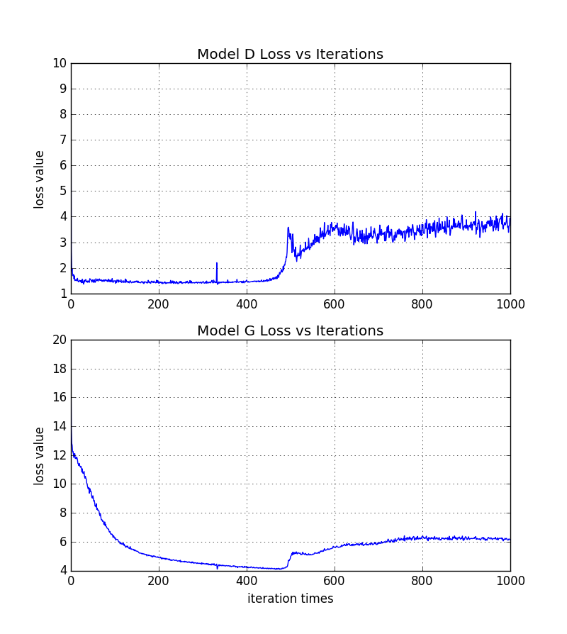
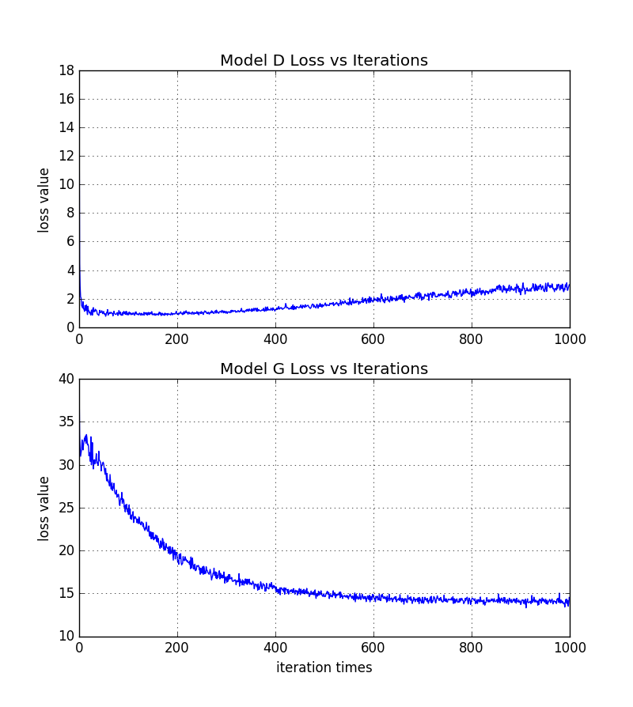

Image to Image translation with Conditional Adversarial Networks
========================================

Tensorflow implementation of the [Image-to-Image Translation Using Conditional Adversarial Networks](https://arxiv.org/pdf/1611.07004.pdf), which learns a mapping(transformation) from the input sketches(e.g. labels, edges or aerial) to the output photos.    
Please feel free to check the [Algorithm Notes](https://onenote.com/webapp/pages?token=614_NsU-o190Ojo4FyLIu0VCRLJ95GgroU116TKiSbeUCB3GlJqa2XfplyrOFK-k80EYRba0o5rhjr6z0R2aZeZqfC4jiswf0&id=636511293571190198) for more architectural details review.

## Introduction
In this work, I completed the overall network construction, and used two datasets, CUFS Students Faces and Facades, to train the model. Below sections show more details about the dataset, model architectures and package executions, also include the experimental results to verify the accuracy of my performance.

## Package Clarification
### Data
In this work, I use two types of datasets to train the model, each of them gave me the promising results.
1. [_CUFS_Students_](http://mmlab.ie.cuhk.edu.hk/archive/facesketch.html): includes the human face sketches and the real photos, total **88** training and **100** testing instances respectively.

2. [_Facades_](http://cmp.felk.cvut.cz/~tylecr1/facade/): presents a dataset of facade images assembled at the Center for Machine Perception, which includes **606** rectified images of facades from various sources, which have been manually annotated. The facades are from different cities around the world and diverse architectural styles.    

Here, I implemented some pre-processing operations on the CUFS dataset for better usage.    
1. **cufs_students**: converted raw images into ndarray format into '.npy' files, selected 50 test images as validation data, including some data augementation operations like normalization, random flip and random crop. This dataset will be used by the model **img2img**.     

2. **cufs_std_concat**: concatenated sketches and corresponding photos into single image, without any data augmentation. This dataset will be used by the model **img2img_x**.  

3. **facades**: same data format as the **cufs_std_concat**. The model **img2img_x** includes some data augmentation operations when loading images during the training and testing.

### Models
Here I created two models, _img2img_x_ and _img2img_. The overall structures are similar, but still exist some differences in the practical implementations.

1. **_img2img_x_**          
- suitable to load raw concatenated images (e.g. cufs_std_concat and facades) for training and testing.
- uses standard conv, deconv and linear layers in Tensorflow.
- includes all batch normalization layers as the class variables in order to achieve the pre-initialization.

2. **_img2img_**   
- suitable to load pre-stored '.npy' dataset (cufs_students) for training and testing.
- uses slim and paritial structure in Tensorflow to stack functional layers together.
- excludes all function layers in the generator and discriminator from the class variables.

Both above two structures can provide reasonable results with similar running time and memory cost. However, the _model img2img_x outperforms than the model img2img in terms of the sample results and loss status during the training_. The main reason might be those pre-initialized bacth normlization layers.

### Other Files
Besides two model classes, there are several essential files in the package.   
1. **_main_img2img_**: the main code to execute training, testing or showing loss curve, allows to input multiple arguments by users, such as dataset_name, training iterations and phase.   

2. **_model_**: all functional layers (e.g. conv, deconv, linear, leaky relu) are defined here.

3. **_dataLoader_**: includes all data loader functions.

4. **_utils_**: includes some helper functions like the image noise adding, image pre-processing and loss curve ploting.

## Code Execution
### Environment Prerequisites
In order to execute the package correctly, please make sure your system has been installed below packages:    
- Linux
- Python with essential packages (e.g. numpy, matplotlib, scipy)
- NVIDIA GPU + CUDA 8.0 + CuDNNV5.1
- Tensorflow

### Getting Start
- Donwload this repo or using _git clone_

- **Train the model**       
The default phase is training, and it's better to specify the dataset name, such as `cufs_students` or `facades`, the default is `cufs_std_concat`. 

```bash
python main_img2img.py --dataset_name=cufs_std_concat
```
  
- **Test the model**    
Remeber to specify the dataset name while testing.
```bash
python main_img2img.py --dataset_name=facades --phase=test
```

- **Show loss curve**
```bash
python main_img2img.py --curveShow=True
```
## Experiments Results
### cufs_std_concat dataset
Blow images are obtained from the dataset _cufs_std_concat_ using the mode _img2img_x_. The **left most** one is the input sketch and **right most** one represents the real photo. From left to right shows the generated samples along the training iteratons(iter idx: 10, 250, 600, 800, 1000).
<p >
  
  
  
  
  
  
  
</p>

Below figure shows the loss curve from generator and discriminator during the training.

<div align=center>
  
</div>


**More Samples**    
**_Left_:** sketch **_Middle_:** generated sample **_Right_:** real photo
<p >
<align="left">
  
<align="right">
  
</p>
<p >
<align="left">
  
<align="right">
  
</p>

**Test Results**       
**_Left_:** sketch **_Middle_:** generated tests **_Right_:** real photo
<p >
<align="left">
  
<align="right">
  
</p>
<p >
<align="left">
  
<align="right">
  
</p>


### cufs_students dataset
Blow images are obtained from the dataset _cufs_students_ using the mode _img2img_. Compared with the previous results, below generated faces are more blurred, and the model _img2img_ performs more fluctuations and unstable due to the implementation of batch normalization layers probably.

**Samples**    
**_Left_:** sketch **_Middle_:** generated sample **_Right_:** real photo
<p >
<align="left">
  
<align="right">
  
</p>
<p >
<align="left">
  
<align="right">
  
</p>

**Test Results**       
**_Left_:** sketch **_Middle_:** generated tests **_Right_:** real photo
<p >
<align="left">
  
<align="right">
  
</p>
<p >
<align="left">
  
<align="right">
  
</p>


### facades dataset
Blow images are obtained from the dataset _facades_ using the mode _img2img_x_. The **left most** one is the input sketch and **right most** one represents the real photo. From left to right shows the generated samples along the training iteratons(iter idx: 10, 250, 600, 800, 1000).
<p >
  
  
  
  
  
  
  
</p>

Below figure shows the loss curve from generator and discriminator during the training.
<div align=center>
  
</div>


**More Samples**    
**_Left_:** sketch **_Middle_:** generated sample **_Right_:** real photo
<p >
<align="left">
  
<align="right">
  
</p>
<p >
<align="left">
  
<align="right">
  
</p>

**Test Results**       
**_Left_:** sketch **_Middle_:** generated tests **_Right_:** real photo
<p >
<align="left">
  
<align="right">
  
</p>
<p >
<align="left">
  
<align="right">
  
</p>
