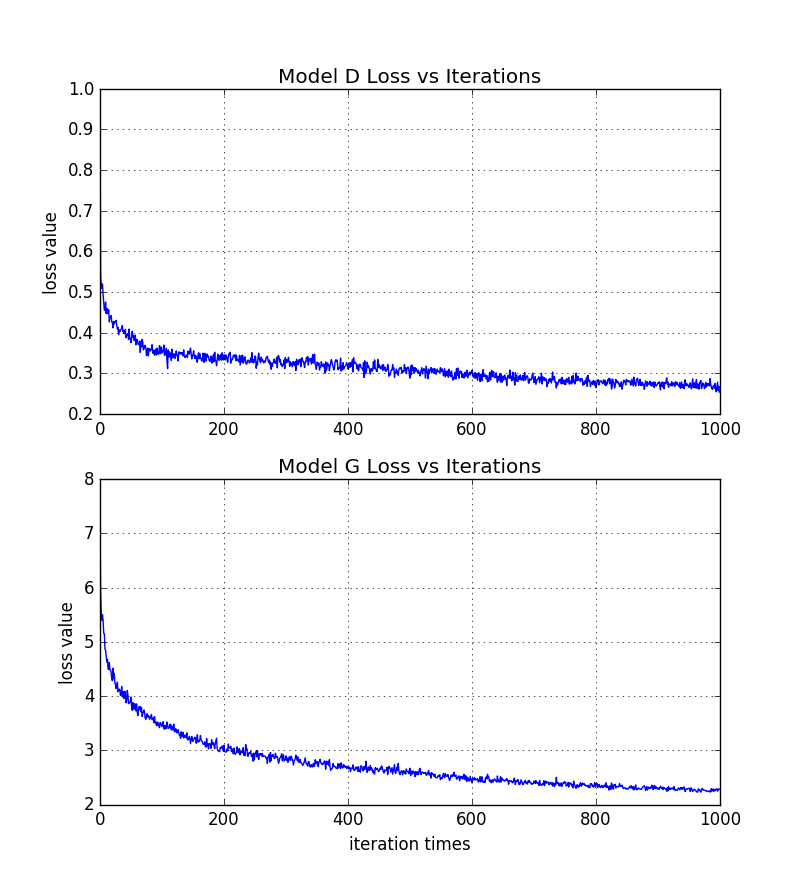
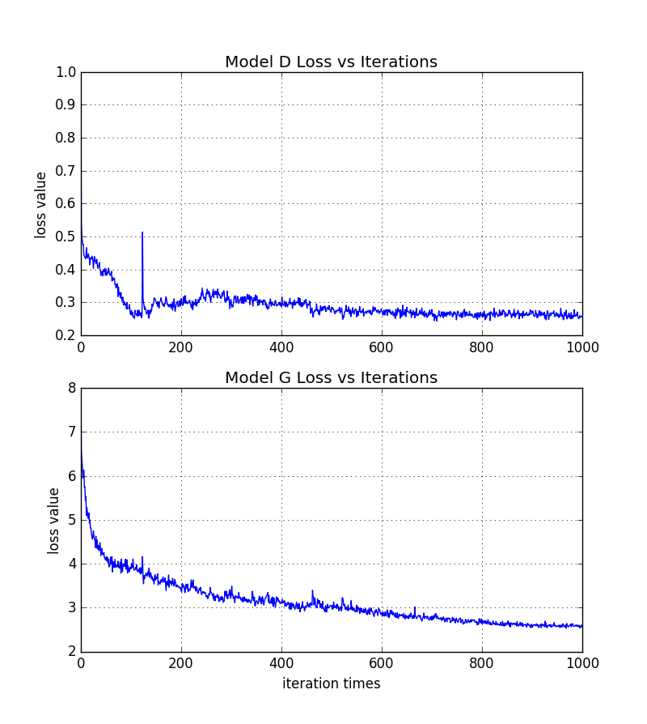
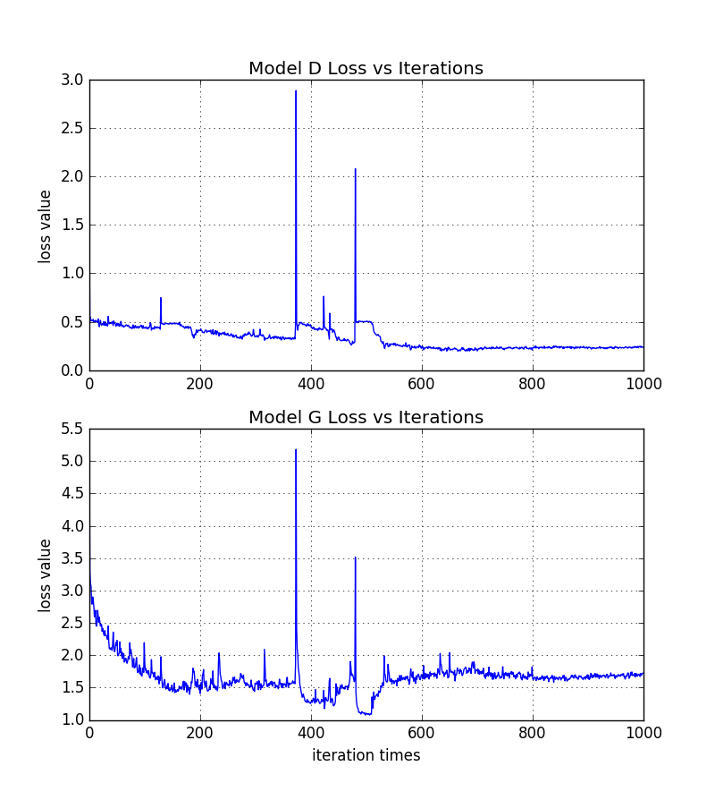

Unpaired Image to Image translation with cycleGAN
========================================

Tensorflow implementation of the [Unparied Image-to-Image Translation Using Cycle-Consistent Adversarial Networks](https://arxiv.org/pdf/1703.10593.pdf), which learns a characteristic mapping(transformation) between two data collections.

Please feel free to check the [Algorithm Notes](https://onenote.com/webapp/pages?token=4a-cUba9Pttcu9oKzpfF_J5mmj4MMyy3pyo9Lo3zNHgU8a4afgRcYtNDhzeZzkiB-oXXA13HFagcdxTixizlIb9Va7AhZvMQ0&id=636528503633738324) for more architectural details review.

## Introduction
Based on the project _Image-to-image using conditional GAN_, cycleGAN is able to learn the underlying characteristics between two data collections without any paired image for training. Here I trained and tested the model using three datasets, **horse2zebra**, **monet2photo** and **cufs student faces**. Below sections show more details about the dataset, model architectures and package executions, also include the experimental results to verify the accuracy of my performance.

## Package Clarification
### Data
The dataset for cycleGAN is [here](http://people.eecs.berkeley.edu/~taesung_park/CycleGAN/datasets/). You can also check the .sh file _download_dataset.sh_ to download those data automatically via terminal.       

Download data via dataset name
```bash
bash ./download_dataset.sh monet2photo
```
**_Note:_** For downloaded dataset, please separate the test files into two parts, one for the test, called **testA (and testB)**, the other for the valication usage, called **valA (and valB)**.


### Models
**_modules_**                    
Contains discriminators and generators applied in the cycleGAN. In addition, we create two types of generator, one contains the U-net structure which is similar as the one in cGAN; the other one contains the Residual net block to update the network performance.       

In both discriminator and generator, we use the **_instance normalization_** to substitute the original **_batch normalization_** refers to the paper network details.

**_cycleGAN_**          
Contains the main structure of the cycleGAN, including some helper functions like _cycle consistency_, _sample generation_ and _test_. Users can determine different dataset names, phases(e.g. train, test or curveShow), max training iteration, and so on.


### Other Files
Besides two model classes, there are several essential files in the package.   
1. **_main_img2img_**: the main code to execute training, testing or showing loss curve, allows to input multiple arguments by users, such as dataset_name, training iterations and phase.   

2. **_model_**: all functional layers (e.g. conv, deconv, linear, leaky relu) are defined here.

3. **_dataLoader_**: includes all data loader functions.

4. **_utils_**: includes some helper functions like the image noise adding, image pre-processing and loss curve ploting.


## Code Execution
### Environment Prerequisites
In order to execute the package correctly, please make sure your system has been installed below packages:    
- Linux
- Python with essential packages (e.g. numpy, matplotlib, scipy)
- NVIDIA GPU + CUDA 8.0 + CuDNNV5.1
- Tensorflow

### Getting Start
- Donwload this repo or using _git clone_

- Train the model    
The default phase is training, and it's better to specify the dataset name, such as 'cufs_students' or 'horse2zebra', the default is 'horse2zebra'. 

```bash
python main_img2img.py --dataset_name=monet2photo
```
  
- Test the model    
Remeber to specify the dataset name while testing.
```bash
python main_img2img.py --dataset_name=monet2photo --phase=test
```

- Show loss curve
```bash
python main_img2img.py --curveShow=True
```

## Experiments Results
- ### horse2zebra dataset
Blow images are obtained from the dataset _horse2zebra_. X represents the _horse_ data collection and Y represents the _zebra_ data collection. The network is aimed to learn the _stripe_ characteristic.   

**_Forward Cycle: X -> Y'=G(X) -> X'=F(Y')_**                 
The **left most** one is a horse, showing the training process of **_generator G_**. From left to right shows the generated samples along the training iteratons(iter idx: 10, 250, 600, 800, 1000).

<p >
  
  
  
  
  
  
  
</p>

The **left most** one is the a horse, showing the training process of **_generator F_**. From left to right shows the generated samples along the training iteratons(iter idx: 10, 250, 600, 800, 1000).

<p >
  
  
  
  
  
  
  
</p>

**_Backward Cycle: Y -> X'=F(Y) -> Y'=G(X')_**                 
The **left most** one is a zebra, showing the training process of **_generator F_**. From left to right shows the generated samples along the training iteratons(iter idx: 10, 250, 600, 800, 1000).

<p >
  
  
  
  
  
  
  
</p>

The **left most** one is a zebra, showing the training process of **_generator G_**. From left to right shows the generated samples along the training iteratons(iter idx: 10, 250, 600, 800, 1000).

<p >
  
  
  
  
  
  
  
</p>

Below figure shows the loss curve from generator and discriminator during the training.
<div align=center>
  
</div>


**Test Results**       
**_Left_:** horse(X) || **_Right_:** generated sample zebra(Y')
<p >
<align="left">
  
<align="center">
  
<align="right">
  
</p>

**_Left_:** zebra(Y) || **_Right_:** generated sample horse(X')
<p >
<align="left">
  
<align="center">
  
<align="right">
  
</p>

- ### monet2photo dataset
Blow images are obtained from the dataset _monet2photo_. X represents the _monet_ data collection and Y represents the _photo_ data collection.   

**_Forward Cycle: X -> Y'=G(X) -> X'=F(Y')_**                 
The **left most** one is a monet, showing the training process of **_generator G_**. From left to right shows the generated samples along the training iteratons(iter idx: 10, 250, 600, 800, 1000).

<p >
  
  
  
  
  
  
  
</p>

The **left most** one is the a monet, showing the training process of **_generator F_**. From left to right shows the generated samples along the training iteratons(iter idx: 10, 250, 600, 800, 1000).

<p >
  
  
  
  
  
  
  
</p>

**_Backward Cycle: Y -> X'=F(Y) -> Y'=G(X')_**                 
The **left most** one is a real view photo, showing the training process of **_generator F_**. From left to right shows the generated samples along the training iteratons(iter idx: 10, 250, 600, 800, 1000).

<p >
  
  
  
  
  
  
  
</p>

The **left most** one is a real view photo, showing the training process of **_generator G_**. From left to right shows the generated samples along the training iteratons(iter idx: 10, 250, 600, 800, 1000).

<p >
  
  
  
  
  
  
  
</p>

Below figure shows the loss curve from generator and discriminator during the training.
<div align=center>
  
</div>


**Test Results**       
**_Left_:** monet(X) || **_Right_:** generated view photo(Y')
<p >
<align="left">
  
<align="center">
  
<align="right">
  
</p>

**_Left_:** real view photo(Y) || **_Right_:** generated sample monet(X')
<p >
<align="left">
  
<align="center">
  
<align="right">
  
</p>

- ### cufs_students dataset
Blow images are obtained from the dataset _cufs_students_. X represents the _sketch faces_ data collection and Y represents the _real photo faces_ data collection.    

**_Forward Cycle: X -> Y'=G(X) -> X'=F(Y')_**                 
The **left most** one is the input sketch, showing the training process of **_generator G_**. From left to right shows the generated samples along the training iteratons(iter idx: 10, 250, 600, 800, 1000).

<p >
  
  
  
  
  
  
  
</p>

The **left most** one is the input sketch, showing the training process of **_generator F_**. From left to right shows the generated samples along the training iteratons(iter idx: 10, 250, 600, 800, 1000).

<p >
  
  
  
  
  
  
  
</p>

**_Backward Cycle: Y -> X'=F(Y) -> Y'=G(X')_**                 
The **left most** one is the input real photo, showing the training process of **_generator F_**. From left to right shows the generated samples along the training iteratons(iter idx: 10, 250, 600, 800, 1000).

<p >
  
  
  
  
  
  
  
</p>

The **left most** one is the input real photo, showing the training process of **_generator G_**. From left to right shows the generated samples along the training iteratons(iter idx: 10, 250, 600, 800, 1000).

<p >
  
  
  
  
  
  
  
</p>

Below figure shows the loss curve from generator and discriminator during the training.
<div align=center>
  
</div>


**Test Results**       
**_Left_:** sketch(X) || **_Right_:** generated sample faces(Y')
<p >
<align="left">
  
<align="center">
  
<align="right">
  
</p>

**_Left_:** real faces(Y) || **_Right_:** generated sample sketches(X')
<p >
<align="left">
  
<align="center">
  
<align="right">
  
</p>
